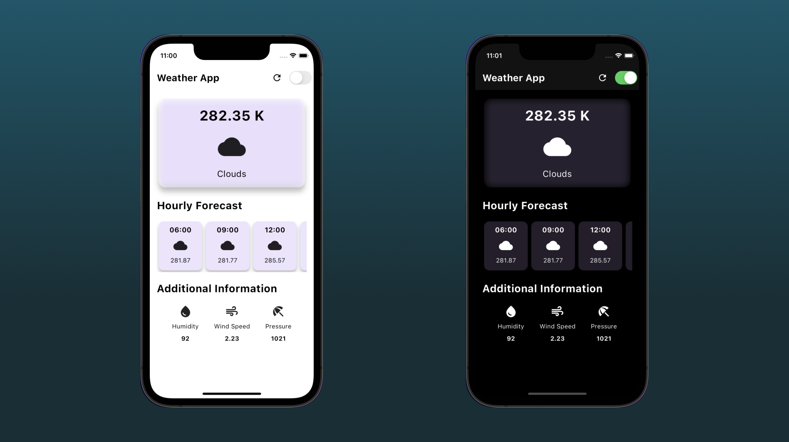

# Weather App

## Overview
This Flutter-based weather app provides users with current weather information and a 5-hour hourly forecast. It features a clean and intuitive interface, with the ability to switch between light and dark themes.

## Features
- **Dynamic Theming:** The app supports both light and dark themes, providing users with a visually pleasing experience in different lighting conditions.
- **Current Weather Display:** The main screen displays the current temperature, weather icon, and sky conditions. The backdrop filter adds a subtle blur effect for an aesthetically pleasing background.
- **Hourly Forecast:** Users can view the hourly forecast for the next 5 hours, including the time, weather icon, and temperature.
- **Additional Information:** The app provides additional weather information such as humidity, wind speed, and pressure in a concise and organized manner.

## Dependencies
- **Provider Package:** Utilized for state management, enabling seamless updates to the UI based on theme changes.
- **HTTP Package:** Used to make API calls to OpenWeatherMap for retrieving weather data.

## How to Run
1. Clone the repository.
2. Open the project in a Flutter-compatible IDE (e.g., Visual Studio Code, Android Studio).
3. Run the app on an emulator or physical device.
